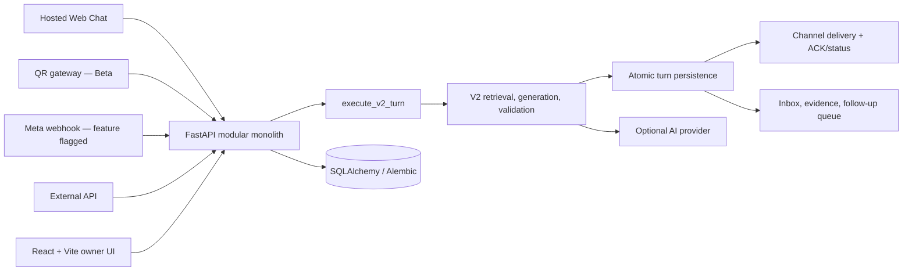

# VELOR

**منصة محادثات مبيعات للتجار المصريين، توضّح أين يحتاج الفريق إلى التدخل، وتقترح ردودًا مرتبطة بأدلة المتجر، وتصعّد عدم اليقين بدل التخمين.**

> **الحالة الحالية:** بناء قوي للتطوير والعرض وPilot مضبوط عبر Web Chat. المشروع ليس خدمة SaaS مدفوعة جاهزة للإنتاج: تكامل Meta الرسمي، الدفع الذاتي، التشغيل المُدار، واعتماد جودة مزود AI الحقيقي ما زالت بوابات خارجية مفتوحة.


## لماذا VELOR؟

فرق المبيعات التي تعمل عبر المحادثات تواجه ثلاث مشكلات مترابطة: الرسائل المهمة تضيع داخل صندوق الوارد، الردود السريعة قد تتجاوز بيانات الكتالوج والسياسات، وعدم اليقين يُخفى أحيانًا خلف إجابة واثقة. VELOR يجمع هذه الحلقة في مساحة عمل واحدة:

1. يلتقط المحادثة ويحفظها داخل نطاق التاجر.
2. يسترجع سياق العميل والكتالوج والسياسات والأدلة المصدرية.
3. يكوّن ردًا مقترحًا عبر مسار V2 المقيّد بالحقائق.
4. يتحقق من الادعاءات، ويرفض أو يصعّد ما لا يملك له دليلًا كافيًا.
5. يحفظ القرار ونيّة التسليم قبل متابعة حالة الإرسال.
6. يعرض لفريق المبيعات قائمة متابعة قابلة للتنفيذ، من دون اختراع إيراد أو نتيجة شراء.

## القدرات الحالية

| القدرة | الحالة | الحد الفعلي |
|---|---|---|
| Hosted Web Chat | Implemented | جلسة زائر، رسائل idempotent، حفظ للمحادثة، ومسار V2 افتراضي |
| Inbox وConversation Workspace | Implemented | محادثة، أدلة، رد مقترح، تصعيد/تدخل بشري، ومتابعات |
| Catalog وPolicy Context | Implemented | استيراد ومعالجة محدودة الحجم؛ الحقائق الحساسة تبقى مقيدة بالمصدر |
| V2 Commerce Conversation Path | Implemented | تخطيط، كتابة، تحقق، محاولة إصلاح واحدة، وfallback محدود |
| Authentication وTenant Isolation | Implemented and tested | JWT/API-key/internal boundaries مع استعلامات tenant-scoped في المسارات النشطة |
| Delivery Reliability | Implemented and tested | intent دائم، حالات صريحة، انتقالات monotonic، وExternal API ACK |
| Egyptian Commerce Evaluation | Implemented offline | fixtures اصطناعية وإعادة تشغيل deterministic؛ ليست قياسًا لنموذج production |
| WhatsApp QR Gateway | Beta | عملية Node اختيارية؛ ليست بديلًا معتمدًا لـWhatsApp Business Platform |
| Meta Webhook Foundation | Disabled by default | أساس webhook موجود، لكن onboarding والتشغيل الحقيقي غير مثبتين |
| Billing | Presentation only | لا checkout ولا payment webhook ولا entitlement lifecycle |
| Revenue/Orders | Not connected | لا تُستنتج من المحادثة؛ تبقى القيم المالية `null/not_connected` دون مصدر موثوق |

## كيف يعمل النظام؟



المسارات الأربعة النشطة—Web، QR، Meta، وExternal API—تتلاقى في use case واحد للقرار والحفظ. التحقق من الطلب والمصادقة وحل التاجر يبقى في route أوadapter، بينما يظل التسليم مرحلة مستقلة لا تستطيع إعلان الرسالة delivered قبل وصول دليل التسليم المناسب.

للتفاصيل راجع [Current Architecture](docs/architecture/CURRENT_ARCHITECTURE.md) و[Architecture Decision Records](docs/README.md#architecture-decision-records).

## التقنيات المستخدمة فعليًا

- **Frontend:** React 18، Vite 5، React Router، Axios، Tailwind CSS، وPlaywright لأتمتة Browser QA.
- **Backend:** Python 3.11/3.12، FastAPI، Pydantic، SQLAlchemy، Alembic، وpytest.
- **Persistence:** SQLite للتطوير والاختبارات المحلية؛ PostgreSQL 16 هو مسار التحقق والإطلاق.
- **AI and retrieval:** Groq client اختياري، RAG محلي للمعرفة، وطبقات تحقق من الدليل والادعاء.
- **Messaging:** Node.js/Express/Baileys لبوابة QR التجريبية، وMeta webhook خلف feature flag.
- **Reliability:** processing claims، durable webhook inbox، delivery state machine، scheduler، وRedis/RQ اختياريان.
- **Quality:** npm lockfiles، Python lockfiles، GitHub Actions، secret/artifact scanner، واختبارات contract وtenant isolation وdelivery.

## هيكل المشروع

```text
.
├── backend/
│   ├── main.py                  # FastAPI composition root and HTTP routes
│   ├── routers/                 # Auth, CRM, catalog, knowledge, webhook, operations
│   ├── services/                # V2 use case, decision, persistence, delivery, evidence
│   ├── evaluation/              # Reproducible Egyptian commerce evaluation
│   ├── migrations/              # Alembic revisions
│   ├── workers/ and engine/     # Optional/background and retained compatibility work
│   ├── tests/                   # Backend and gateway behavior tests
│   └── whatsapp_gate.js         # Optional QR gateway (Beta)
├── frontend/
│   ├── src/pages/               # Landing, auth, web chat, dashboard, inbox, settings
│   ├── src/components/          # Shared UI and conversation workspace
│   ├── src/services/            # API client boundary
│   ├── tests/                   # Node contract tests
│   └── scripts/                 # Vite wrappers and browser QA
├── docs/
│   ├── architecture/            # Current architecture and truth contracts
│   ├── adr/                     # Accepted architecture decisions
│   ├── audits/                  # Date-bound engineering evidence
│   ├── setup/                   # Reproducible local setup
│   └── security/                # Local artifact handling
├── tools/                       # Repository hygiene and lock verification
└── .github/                     # CI and dependency update configuration
```

## التشغيل المحلي

### المتطلبات

- Git
- Python 3.11 أو 3.12
- Node.js 20
- npm 10 أو أحدث

الأوامر التالية مخصصة للتطوير والتحقق المحلي، وليست وصفة نشر production.

### 1. تثبيت Backend

من جذر المستودع على PowerShell:

```powershell
py -3.12 -m venv .venv
.\.venv\Scripts\Activate.ps1
python -m pip install --upgrade pip
python -m pip install -r backend\requirements-dev.lock
if (-not (Test-Path backend\.env)) { Copy-Item backend\.env.example backend\.env }
```

ولـmacOS/Linux استخدم `python3 -m venv .venv` ثم `source .venv/bin/activate` واستبدل `Copy-Item` بـ`cp`.

ولّد محليًا قيمتين عشوائيتين **مختلفتين** لـ`JWT_SECRET` و`NODE_INTERNAL_SECRET`، وضعهما في `backend/.env` فقط. لا تلصق القيم في issue أو terminal transcript أو commit أو ملف frontend. يمكن توليد كل قيمة محليًا بالأمر التالي:

```powershell
python -c "import secrets; print(secrets.token_urlsafe(48))"
```

ثم:

```powershell
Set-Location backend
python -m alembic upgrade head
python -m uvicorn main:app --reload --host 127.0.0.1 --port 8000
```

- الصحة: `GET http://127.0.0.1:8000/health`
- الجاهزية: `GET http://127.0.0.1:8000/ready`
- OpenAPI في development: `http://127.0.0.1:8000/docs`

### 2. تثبيت Frontend

في جلسة طرفية أخرى:

```powershell
Set-Location frontend
if (-not (Test-Path .env)) { Copy-Item .env.example .env }
npm ci
npm run dev
```

افتح `http://127.0.0.1:5173`. حافظ على استخدام hostname واحد في المتصفح و`VITE_API_BASE` حتى تعمل SameSite cookies كما هو متوقع.

### 3. بوابة QR الاختيارية

```powershell
Set-Location backend
npm ci
node whatsapp_gate.js
```

تحتاج البوابة `NODE_INTERNAL_SECRET` نفسه المستخدم في Backend، وتبدأ على loopback حسب المثال. لا تعرّضها للإنترنت كتكامل WhatsApp رسمي.

## متغيرات البيئة

ابدأ دائمًا من `backend/.env.example` و`frontend/.env.example`. ملفات `.env` الحقيقية مستبعدة من Git.

| المتغير | الغرض | محليًا |
|---|---|---|
| `JWT_SECRET` | توقيع جلسات Backend | مطلوب؛ قيمة فريدة وطويلة |
| `NODE_INTERNAL_SECRET` | مصادقة Backend ↔ QR gateway | مطلوب للمسارات الداخلية؛ مختلف عن JWT |
| `DATABASE_URL` | اتصال SQLAlchemy | مثال التطوير يستخدم SQLite؛ استخدم PostgreSQL مُدارًا للإطلاق |
| `ALLOWED_ORIGINS` / `ALLOWED_HOSTS` | حدود المتصفح والـhost | اضبطها صراحة ولا تستخدم wildcard في release |
| `GROQ_API_KEY` | مزود AI الاختياري | اتركه فارغًا لتشغيل fallback محدود وحالة readiness متدهورة |
| `PUBLIC_WEB_CHAT_RESPONSE_ENGINE` | اختيار مسار Web | `v2` هو الافتراضي والإلزامي في release |
| `WHATSAPP_RESPONSE_ENGINE` | اختيار QR/Meta | `v2` هو الافتراضي والإلزامي في release |
| `EXTERNAL_API_RESPONSE_ENGINE` | اختيار External API | `v2` هو الافتراضي والإلزامي في release |
| `ENABLE_META_WEBHOOK` | تشغيل Meta ingress | `false` افتراضيًا |
| `VITE_API_BASE` | عنوان Backend المضمّن في browser bundle | عنوان عام فقط؛ لا تضع أي secret في `VITE_*` |

المتغيرات الاختيارية وحدود الرفع وRedis وMeta موثقة داخل ملفات المثال نفسها. استخدم secret manager في staging/production، ولا تضع الأسرار في GitHub variables غير المشفرة أو داخل workflow.

## الاختبارات وLint وBuild

من جذر المستودع:

```powershell
python tools\check_repository_hygiene.py --inventory-local
python tools\verify_locked_python.py

Push-Location backend
python -m pytest -q
node --check whatsapp_gate.js
node --test tests/whatsapp_gate_auth.test.js
Pop-Location

Push-Location frontend
npm test
npm run lint
npm run build
Pop-Location
```

للتدقيق الشبكي للاعتماديات عند توفر registry:

```powershell
Push-Location frontend
npm audit --omit=dev --audit-level=high
Pop-Location

Push-Location backend
npm audit --audit-level=high
Pop-Location
```

ملف [CI](.github/workflows/ci.yml) يعيد تشغيل hygiene، Backend على Python 3.11 و3.12، PostgreSQL migration/isolation smoke، Frontend test/lint/build، وفحوص بوابة QR. نجاح الاختبارات لا يثبت وحده جاهزية production أو سلامة مزود خارجي.

## الحالة والحدود المعروفة

### Implemented

- Web Chat وواجهة التاجر ومساحة المحادثة وقائمة المتابعة.
- V2 كمسار القرار والحفظ الافتراضي للقنوات الأربع.
- Evidence/catalog/policy grounding وhuman escalation.
- Tenant-scoped authentication/query boundaries في المسارات النشطة.
- Durable delivery intent وACK/status handling.
- Evaluation harness اصطناعي قابل لإعادة التشغيل.

### Tested

- تغطية محلية وCI لمسار Backend، tenant isolation، delivery/retry، QR authentication، frontend contracts، lint، build، وPostgreSQL smoke.
- أغلب اختبارات provider وdelivery تستخدم mocks أو fixtures؛ راجع [Phase reports](docs/README.md) لمعرفة حدود كل دليل.

### Demonstrated

- لقطات المنتج وWeb Chat وواجهات التاجر موثقة ببيانات Demo.
- الـevaluation المرجعي يثبت عقد الـfixtures فقط، ولا يمثل أداء نموذج حي أو عملاء حقيقيين.

### Not production-ready

- لا يوجد hosting/monitoring/backup restore مُدار ومثبت على بيئة عامة.
- Meta onboarding وlive WhatsApp delivery غير مثبتين؛ QR ما زال Beta.
- لا يوجد checkout أو payment lifecycle أو account recovery مكتمل.
- جودة مزود AI الحقيقي، latency، والتكلفة تحتاج قياسًا صريحًا على staging.
- V1 وبعض المسارات القديمة باقية للrollback والتوافق، وليست مرجع القرار الافتراضي.

### Market evidence

لا يحتوي المستودع على دليل مثبت لعملاء دافعين أو retention أو conversion أو revenue impact. قوالب الـpilot وبيانات الـdemo ليست market validation.

## التوثيق

- [Current architecture](docs/architecture/CURRENT_ARCHITECTURE.md)
- [Architecture decisions](docs/README.md#architecture-decision-records)
- [Reproducible local setup](docs/setup/LOCAL_SETUP.md)
- [Security policy](SECURITY.md)
- [Contributing guide](CONTRIBUTING.md)
- [Documentation map](docs/README.md)

## License

لم يُعتمد ترخيص مفتوح المصدر بعد. وجود الكود على GitHub لا يمنح تلقائيًا حق النسخ أو التعديل أو إعادة التوزيع. راجع اقتراحات Phase 8 واختر الترخيص قانونيًا قبل النشر المفتوح؛ لم يُضف ملف `LICENSE` عمدًا.

## English summary

VELOR is a conversation-first sales workspace for Egyptian merchants. It identifies conversations that need attention, proposes evidence-grounded replies, and escalates uncertainty instead of guessing. The hosted Web Chat, V2 decision/persistence path, tenant boundaries, delivery lifecycle, and offline evaluation harness are implemented and tested locally. Official Meta onboarding, paid self-service, managed production operations, and live-provider quality certification remain incomplete.
