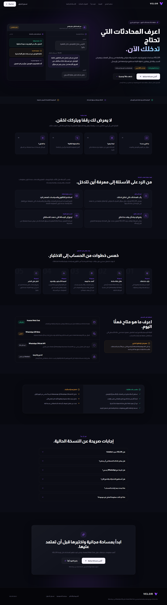
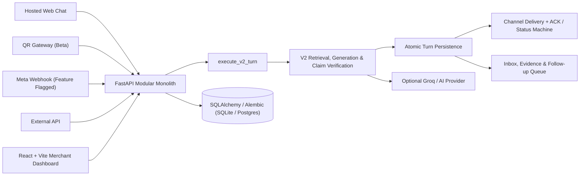
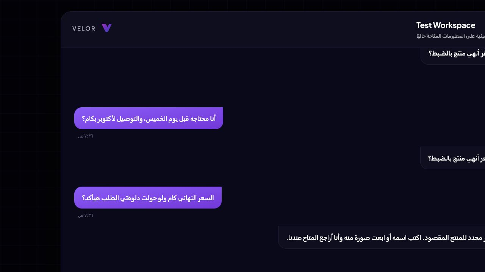
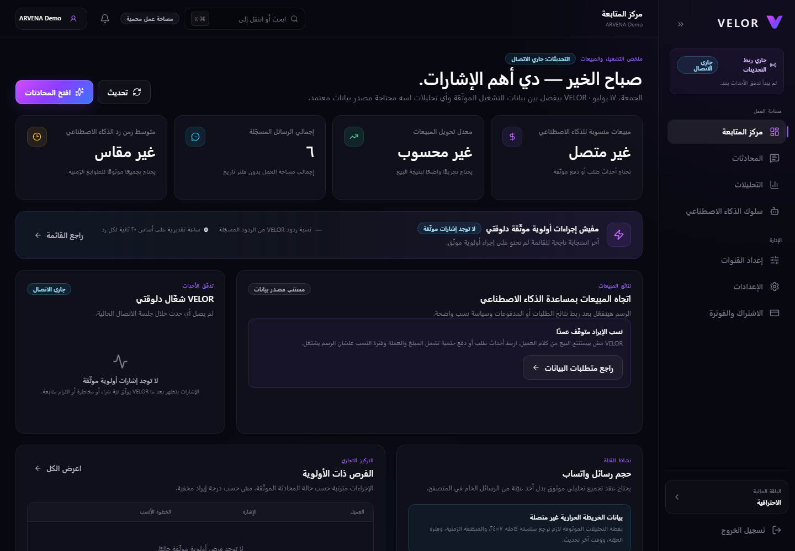
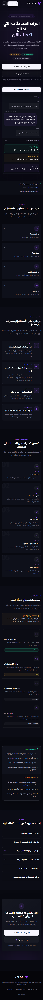

# VELOR

**An evidence-grounded conversational sales workspace and AI copilot for e-commerce merchants in Egypt and North Africa.**

VELOR captures customer sales conversations across messaging channels, retrieves verified merchant catalog and policy context, generates factual suggested responses, and escalates uncertainty to human sales agents instead of hallucinating.

> **Current Repository Status:** Production-ready foundation and demonstration architecture for local development, staging verification, and pilot testing via Web Chat. This project is a technical portfolio showcasing a bounded modular monolith architecture, strict tenant isolation, and evidence-grounded AI decision pipelines. External production integrations (official Meta cloud onboarding, payment checkout, and live cloud infrastructure) remain gated.

---



---

## Why VELOR?

Conversational e-commerce sales teams in emerging markets face three core operational challenges: high message volume leads to missed opportunities, fast manual responses often violate inventory or store policy bounds, and generative AI models frequently fabricate unverified claims.

VELOR unifies this workflow within a single evidence-grounded workspace:

1. **Captures and isolates** incoming conversations within explicit merchant tenant boundaries.
2. **Retrieves relevant context** from customer history, product catalog items, and store policies.
3. **Formulates suggested replies** through a factual V2 decision pipeline.
4. **Verifies claims and constraints**, rejecting or escalating responses that lack sufficient factual backing.
5. **Persists decision intent and delivery state** before tracking channel delivery status.
6. **Presents an actionable follow-up queue** to sales teams without fabricating revenue or order completion claims.

---

## Engineering Highlights

Factually verified implementation metrics and architectural guarantees:

- **1,955 Backend Tests Passing**: Comprehensive `pytest` test suite covering HTTP APIs, V2 turn decision logic, tenant isolation boundaries, delivery retry mechanisms, synthetic evaluation harnesses, and DB pool safety.
- **49 Frontend Contract Tests Passing**: Automated Node.js contract test suite validating UI state hydration, decision brief presentation, catalog parsing, analytics cockpit limits, and progressive disclosure rules.
- **Security & Hygiene Automation**: Custom zero-dependency repository hygiene checker (`tools/check_repository_hygiene.py`) verifying secret suppression, synthetic fixture digests, exact lockfile synchronization, and strict `.gitignore` boundaries.
- **Strict Tenant Isolation**: JWT/API-key/internal authentication boundaries with enforced tenant-scoped database queries on all active business routes.
- **Evidence-Grounded AI Approach**: Modular V2 retrieval pipeline (RAG), factual claim verification, single-retry self-repair loop, and explicit fallback to human agent escalation upon low evidence confidence.
- **Accepted Architecture Decision Records**: Six formal ADRs (`docs/adr/0001` through `0006`) defining the canonical V2 path, bounded modular monolith layout, separation of decision from delivery, outbox messaging reliability, tenant boundaries, and offline synthetic evaluation.

---

## Technical Achievements

- **FastAPI Modular Monolith**: Clean pythonic architecture separating HTTP routing adapters, domain use cases (`execute_v2_turn`), persistence layers, and delivery state machines.
- **React 18 & Vite 5 Frontend**: Modern owner dashboard supporting RTL layouts, accessible component architecture, state management, and Playwright browser QA suite.
- **AI Retrieval & Factual Grounding**: Retrieval pipeline combining structured catalog search, store policy RAG, claim verification layers, and graceful model fallbacks.
- **Egyptian Commerce Evaluation Framework**: Reproducible, deterministic offline evaluation harness executing synthetic dialectal Arabic sales scenarios.
- **Reliability & Outbox Pattern**: Monotonic delivery state machine (`pending` -> `submitted` -> `delivered` -> `read` / `failed`) with durable outbox logging, webhook claim tracking, and ACK processing.
- **Security Hygiene & Lock Integrity**: Fully reproducible builds enforced via exact Python requirements locks and Node lockfiles (`package-lock.json` v3).

---

## System Architecture



The four active ingress channels—Web Chat, QR, Meta, and External API—converge into a single canonical decision and persistence pipeline (`execute_v2_turn`). Ingress validation, authentication, and tenant resolution occur at the boundary adapters, while channel delivery operates as a distinct phase that cannot declare a message delivered until valid delivery confirmation is received.

For deeper architectural details, see [Current Architecture](docs/architecture/CURRENT_ARCHITECTURE.md) and [Architecture Decision Records](docs/README.md#architecture-decision-records).

---

## Current Limitations & Roadmap

| Feature / Capability | Status | Implementation Details & Real Limits |
|---|---|---|
| **Hosted Web Chat** | Implemented | Visitor session tracking, idempotent message submission, atomic turn persistence, canonical V2 response path |
| **Inbox & Workspace** | Implemented | Real-time conversation thread, evidence inspector, suggested replies, human escalation, follow-up queue |
| **Catalog & Policy Grounding** | Implemented | Bounded catalog upload & parsing, vector/policy context search, strict source-backed fact constraints |
| **V2 Commerce Response Path** | Implemented | Plan-draft-verify pipeline, single-retry self-repair loop, deterministic safe fallback on uncertainty |
| **Auth & Tenant Isolation** | Implemented & Tested | JWT, API key, and internal service boundaries; tenant-scoped queries across all active routes |
| **Delivery Reliability** | Implemented & Tested | Durable delivery intent, monotonic state machine, external ACK processing, failure logging |
| **Egyptian Commerce Evaluation** | Implemented Offline | Deterministic evaluation harness running synthetic Egyptian dialect fixtures; not a live production model metric |
| **WhatsApp QR Gateway** | Beta | Optional Node.js process using Baileys library for local developer sandbox; not certified for Meta production |
| **Meta Webhook Foundation** | Feature Flagged | Structural webhook handler present (`ENABLE_META_WEBHOOK=false` by default); cloud onboarding disabled |
| **Billing & Payments** | Planned / Presentation Only | UI billing presentation present; no self-service checkout, payment webhook, or subscription lifecycle |
| **Direct Revenue Attribution** | Not Connected | Revenue metrics are not inferred from chats; financial figures remain explicit `null/not_connected` without external source of truth |

---

## Technical Stack

- **Backend**: Python 3.11/3.12, FastAPI, Pydantic v2, SQLAlchemy 2.0, Alembic, pytest.
- **Frontend**: React 18, Vite 5, React Router v6, Axios, Tailwind CSS, Lucide React, Playwright.
- **Persistence**: SQLite (Local development & test suite), PostgreSQL 16 (Migration & deployment verification target).
- **AI & Retrieval**: Groq API client (optional), local knowledge RAG, rule-based claim verification engine.
- **Messaging Integration**: Node.js / Express / Baileys (Optional Beta QR Gateway), Meta Webhook ingress foundation.
- **Quality & Security**: Custom repository hygiene scanner, pinned Python lockfiles, Node lockfiles (v3), GitHub Actions CI.

---

## Demo Gallery

### Hosted Web Chat Customer Interface


### Merchant Landing Page


### Merchant Dashboard & Analytics


### Responsive Mobile Interface


---

## Repository Structure

```text
.
├── backend/
│   ├── main.py                  # FastAPI composition root and HTTP routes
│   ├── routers/                 # Auth, CRM, catalog, knowledge, webhook, operations
│   ├── services/                # V2 use case, decision, persistence, delivery, evidence
│   ├── evaluation/              # Reproducible Egyptian commerce evaluation harness
│   ├── migrations/              # Alembic database revisions
│   ├── workers/ and engine/     # Background task handlers and compatibility modules
│   ├── tests/                   # Backend API and unit test suite (1,955 tests)
│   └── whatsapp_gate.js         # Optional QR gateway process (Beta)
├── frontend/
│   ├── src/pages/               # Landing, auth, web chat, dashboard, inbox, settings
│   ├── src/components/          # Shared UI components and conversation workspace
│   ├── src/services/            # API client layer and HTTP interceptors
│   ├── tests/                   # Node UI contract test suite (49 tests)
│   └── scripts/                 # Vite build wrappers and browser QA automation
├── docs/
│   ├── architecture/            # Architecture contracts and system specifications
│   ├── adr/                     # Accepted Architecture Decision Records (0001–0006)
│   ├── assets/                  # Verified product screenshots and diagrams
│   ├── audits/                  # Date-bound audit ledgers and phase verification logs
│   ├── setup/                   # Environment configuration guide
│   └── security/                # Local artifact handling policy
├── tools/                       # Repository hygiene and lock verification utilities
└── .github/                     # GitHub Actions CI workflows
```

---

## Local Setup & Quickstart

### Prerequisites

- Git
- Python 3.11 or 3.12
- Node.js 20+
- npm 10+

### 1. Backend Setup

From the repository root (PowerShell / Windows):

```powershell
py -3.12 -m venv .venv
.\.venv\Scripts\Activate.ps1
python -m pip install --upgrade pip
python -m pip install -r backend\requirements-dev.lock
if (-not (Test-Path backend\.env)) { Copy-Item backend\.env.example backend\.env }
```

*(On macOS/Linux, use `python3 -m venv .venv`, `source .venv/bin/activate`, and `cp`)*.

Generate distinct secret keys for `JWT_SECRET` and `NODE_INTERNAL_SECRET` in `backend/.env`:

```powershell
python -c "import secrets; print(secrets.token_urlsafe(48))"
```

Initialize database migrations and start the backend development server:

```powershell
Set-Location backend
python -m alembic upgrade head
python -m uvicorn main:app --reload --host 127.0.0.1 --port 8000
```

- **Health Check**: `GET http://127.0.0.1:8000/health`
- **Readiness Check**: `GET http://127.0.0.1:8000/ready`
- **OpenAPI Documentation**: `http://127.0.0.1:8000/docs`

### 2. Frontend Setup

In a separate terminal:

```powershell
Set-Location frontend
if (-not (Test-Path .env)) { Copy-Item .env.example .env }
npm ci
npm run dev
```

Open `http://127.0.0.1:5173` in your browser.

### 3. Optional Beta QR Gateway

```powershell
Set-Location backend
npm ci
node whatsapp_gate.js
```

---

## Verification & Testing

Run all local verification checks from the repository root:

```powershell
# 1. Repository Hygiene & Secret Scanner
python tools\check_repository_hygiene.py --inventory-local

# 2. Python Dependency Lock Verification
python tools\verify_locked_python.py

# 3. Backend Test Suite (1,955 tests)
Push-Location backend
..\.venv\Scripts\python.exe -m pytest -q
node --check whatsapp_gate.js
node --test tests/whatsapp_gate_auth.test.js
Pop-Location

# 4. Frontend Contract Suite (49 tests), Lint & Build
Push-Location frontend
cmd /c npm test
cmd /c npm run lint
cmd /c npm run build
Pop-Location
```

---

## Documentation Index

- [Documentation Map](docs/README.md)
- [Current Architecture Specification](docs/architecture/CURRENT_ARCHITECTURE.md)
- [Architecture Decision Records (ADRs)](docs/README.md#architecture-decision-records)
- [Local Setup Guide](docs/setup/LOCAL_SETUP.md)
- [Security Policy](SECURITY.md)
- [Contributing Guidelines](CONTRIBUTING.md)

---

## License

**Proprietary & Confidential — All Rights Reserved** (Copyright (c) 2026 VELOR).

This repository is publicly accessible for technical portfolio review and architectural evaluation. No license is granted for commercial or non-commercial reuse, modification, or distribution without explicit prior written authorization. See [LICENSE](LICENSE) for details.
