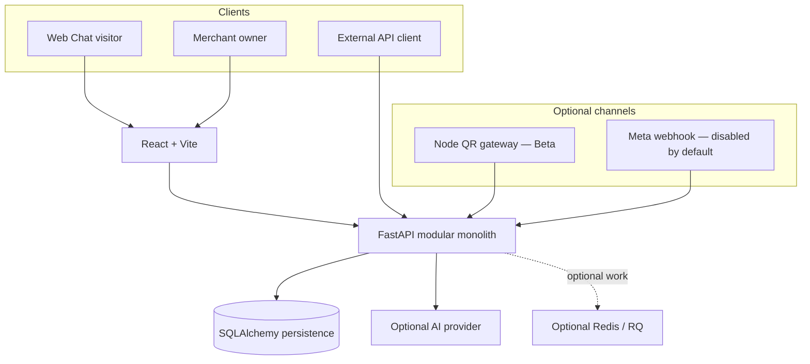
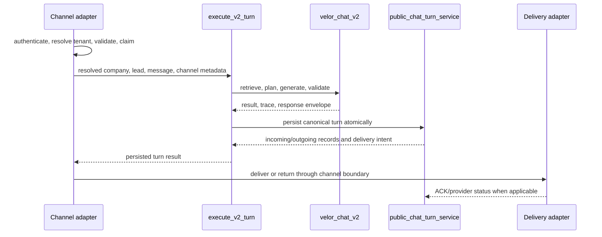

# VELOR current architecture

Status: current implementation reference for Phase 8.
Source basis: the tracked tree at the Phase 8 baseline, verified against routes, services, tests, manifests, migrations, and environment examples.

This document describes what the repository implements today. It is not a target-state diagram and it does not certify a deployment as production-ready.

## System context

VELOR is a conversation-first sales workspace. Customer messages enter through Hosted Web Chat, the optional QR gateway, the feature-flagged Meta webhook, or the authenticated External API. The FastAPI application resolves identity and tenant context, executes the canonical V2 turn, persists the decision and delivery intent, and exposes the resulting conversation and evidence to the React owner workspace.

## Runtime units

| Unit | Entry point | Responsibility | Current boundary |
|---|---|---|---|
| Frontend | `frontend/src/main.jsx`, `frontend/src/App.jsx` | Landing, auth, public chat, dashboard, inbox, workspace, analytics, settings | React/Vite browser application; calls FastAPI through `frontend/src/services/api.js` |
| Backend | `backend/main.py` | HTTP/SSE composition, auth dependencies, public chat, External API, lifecycle startup | One FastAPI deployable; still a broad composition module rather than a thin router-only shell |
| Backend routers | `backend/routers/` | Auth, catalog, CRM, knowledge, operations, streaming, Meta webhook | Route validation and adapter-specific behavior |
| Application/services | `backend/services/` | V2 use case, conversation decision, evidence, atomic persistence, delivery, follow-up and projections | In-process modular-monolith boundaries; not separate services |
| Persistence | `backend/database.py`, `backend/migrations/` | SQLAlchemy models, sessions, Alembic schema evolution | SQLite for local/test; PostgreSQL is the verification/release path |
| QR gateway | `backend/whatsapp_gate.js` | Baileys QR sessions and WhatsApp delivery | Optional Node process protected by an internal secret; Beta only |
| Scheduler/workers | `backend/scheduler.py`, `backend/workers/`, `backend/engine/` | Cleanup, retry/recovery, optional exports and retained advisory/compatibility work | Some workers are optional; retained legacy modules are not canonical V2 authority |
| Evaluation | `backend/evaluation/`, `backend/scripts/run_phase6_evaluation.py` | Offline, reproducible Egyptian commerce evaluation | Synthetic fixtures and reference traces; no provider call by default |

## Canonical conversation path

The accepted V2 path is shared by four ingress adapters. Authentication, tenant resolution, request validation, claims, timeouts, and delivery remain adapter responsibilities. The application use case owns decision-to-persistence orchestration.

The two code authorities are:

- `backend/services/velor_chat_v2.py::get_v2_ai_response` for V2 retrieval, generation, validation, repair, escalation, and bounded fallback.
- `backend/services/public_chat_turn_service.py::persist_v2_public_turn_atomic` for the canonical transaction.

`backend/services/v2_turn_use_case.py::execute_v2_turn` composes those authorities without taking over route validation or provider delivery. V1 remains available only through explicit engine selectors as a rollback/compatibility path.

## Channel adapters

| Channel | Identity and tenant source | V2 selection | Delivery boundary |
|---|---|---|---|
| Web Chat | Signed visitor token bound to company and visitor | `PUBLIC_WEB_CHAT_RESPONSE_ENGINE=v2` | Successful HTTP response is the current sent boundary |
| QR | `X-Internal-Secret` plus validated company context from the gateway | `WHATSAPP_RESPONSE_ENGINE=v2` | Outgoing record starts pending; gateway ACK/status updates it |
| Meta | Verified webhook signature and configured provider-to-company mapping | `WHATSAPP_RESPONSE_ENGINE=v2`; ingress also requires `ENABLE_META_WEBHOOK=true` | Outgoing record starts pending; Graph response and status webhooks update it |
| External API | API-key hash resolves the company; caller supplies customer identity inside that tenant | `EXTERNAL_API_RESPONSE_ENGINE=v2` | Response starts pending and advertises authenticated `/api/external/delivery/ack` |

Release configuration validation rejects V1 selectors for release environments. Meta remains disabled in the public example because an implementation scaffold is not evidence of completed onboarding.

## Decision, persistence, and delivery

VELOR deliberately separates three facts:

1. **A response was decided:** V2 returned a validated answer, escalation, refusal, or fallback.
2. **A turn was persisted:** incoming message, outgoing message, evidence, trace, and related projections committed through the atomic boundary.
3. **A response was delivered:** a channel-specific boundary or provider acknowledgement advanced delivery state.

For QR, Meta, and External API, the outgoing `Message` row is an outbox-like durable delivery intent and starts as `pending`. `backend/services/message_delivery.py` applies idempotent, monotonic transitions and records failure evidence. `backend/services/delivery_reliability.py` implements the tenant-scoped External API ACK contract. The pending sweeper records an explicit timeout reason; it does not rewrite the conversation decision.

There is no Kafka, separate outbox service, or microservice boundary. The existing message/event model is the bounded reliability mechanism.

## Persistence and truth authority

- `Company.company_id` is the tenant key.
- `Message` and linked events are the durable conversation and delivery record.
- `LeadEvidence` retains source-linked factual observations.
- `CompanyKnowledge` contains the merchant catalog/policy knowledge used by current retrieval services.
- `CommercialDecisionLineage` and `CommercialEvent` retain deterministic commercial decision evidence.
- `LeadIntelligenceSnapshot` is advisory and cannot outrank source evidence or canonical commercial lineage.
- Order/payment/revenue truth is unavailable until a verified system-of-record adapter satisfies `VELOR_TRUSTED_OUTCOME_CONTRACT.md`.

Unknown financial values remain `null/not_connected`; conversation text, owner actions, model output, or CRM stage cannot create a paid outcome.

## Authentication and tenant isolation

The active boundaries use different credentials but share one rule: derive tenant context from authenticated or verified context whenever possible.

- Owner routes validate the HttpOnly access JWT and load the company from the signed claim.
- External API routes derive the company from the stored API-key hash, not a client tenant field.
- QR internal routes require the internal secret and a validated company identifier.
- Meta derives company context from a verified webhook and configured phone-number mapping.
- Repository/service queries on the active V2 path include `company_id`, including delivery ACK, memory, evidence, catalog, policy, and worker boundaries covered by Phase 5 tests.

Super-admin cross-tenant access is an explicit role-controlled exception. Legacy V1/advisory modules remain bounded and are not evidence that every historical helper is tenant-safe for reactivation.

## Evidence-grounded AI path

V2 builds bounded context from conversation history, merchant knowledge, product context, policy context, evidence, and current commercial state. It separates merchant/customer content from system instructions, checks answer obligations and sensitive claims, permits one repair attempt, and chooses escalation/refusal/fallback when evidence is insufficient.

The offline evaluation suite versions the dataset and reference response file, records prompt/model/provider identifiers, links claims to evidence IDs, and distinguishes `answer`, `escalation`, `refusal`, and `unsupported_claim`. Its reference metrics are contract checks, not a production model benchmark or customer outcome.

## Frontend information architecture

`frontend/src/App.jsx` defines the current public and protected routes:

- Public: landing, login, signup, terms, privacy, and `/c/:slug` Web Chat.
- Protected: onboarding, dashboard, inbox, conversation workspace, analytics, automations, settings, and billing presentation.
- Legacy customer/settings/analytics URLs redirect to canonical routes.

The inbox is the list/priority surface; `/inbox/:id` is the detailed conversation and owner-action surface. Evidence and suggested replies are advisory presentation of backend state, not an independent browser decision engine.

## Configuration and fail-closed defaults

The committed examples keep secrets empty, V2 selectors enabled, synthetic seeding disabled, Meta disabled, legacy intelligence work disabled, and the QR gateway on loopback with automatic session boot disabled. Release readiness adds PostgreSQL, Redis, provider, origin, host, and channel requirements; a running process or passing unit test is not sufficient production evidence.

## Known boundaries

- `backend/main.py`, `backend/database.py`, and `backend/services/velor_chat_v2.py` remain large modules. Phase 3B extracted one safe use case, not a broad architecture rewrite.
- V1 and several legacy/advisory modules remain for rollback and compatibility; they are not the canonical V2 path.
- QR is Beta and Meta onboarding is incomplete.
- Live AI quality, latency, and cost are not certified by the offline fixture reference.
- Payment, account recovery, managed deployment, monitoring, and restore operations are incomplete.
- SQLite is not the production recommendation.

## Architecture decision records

- [ADR-0001: Canonical V2 conversation path](../adr/0001-canonical-v2-conversation-path.md)
- [ADR-0002: Bounded modular monolith](../adr/0002-bounded-modular-monolith.md)
- [ADR-0003: Separate decision from delivery](../adr/0003-separate-decision-from-delivery.md)
- [ADR-0004: Message-backed delivery reliability](../adr/0004-message-backed-delivery-reliability.md)
- [ADR-0005: Authenticated tenant context](../adr/0005-authenticated-tenant-context.md)
- [ADR-0006: Evidence-grounded offline evaluation](../adr/0006-evidence-grounded-offline-evaluation.md)

These ADRs record accepted implementation decisions. They do not authorize new infrastructure, provider rollout, V1 deletion, or production claims.
