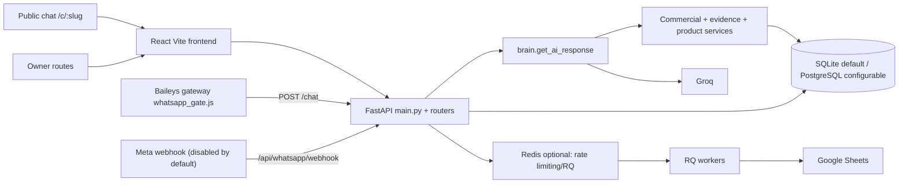
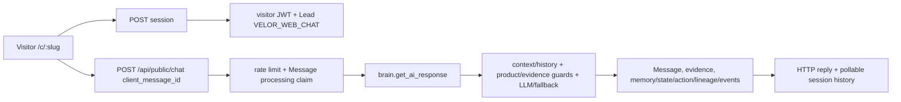
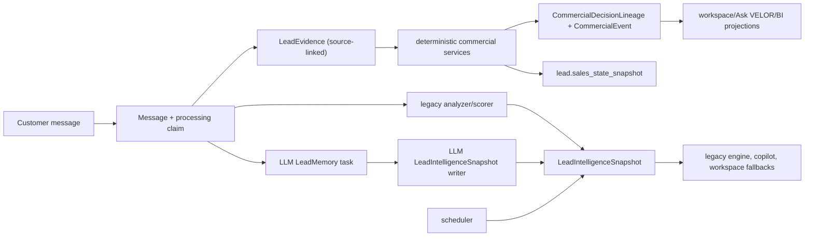

# VELOR System Map

> **Historical snapshot — superseded.** This map captures the pre-consolidation architecture on 2026-07-11. It is kept as historical evidence, not as the current system or launch contract. See [`../release/VELOR_LAUNCH_READINESS_AUDIT.md`](../release/VELOR_LAUNCH_READINESS_AUDIT.md).

Audit date: 2026-07-11. Status labels: **CONFIRMED** means directly observed in source or command output; **RUNTIME-UNVERIFIED** means no local process was available for browser verification.

## Executive architecture summary

**CONFIRMED:** VELOR is a React/Vite owner and public-chat UI over a FastAPI application with SQLite-by-default persistence, an optional Redis/RQ integration, Groq LLM calls, and two WhatsApp transport implementations. `backend/main.py` (3,036 lines) is the HTTP composition root and also owns considerable business and transport logic. `backend/brain.py` (2,036 lines) is the core response pipeline plus a legacy AI/lead engine. The repository contains a newer commercial layer in `backend/services/`, but it remains invoked from the legacy brain rather than replacing it.

## Runtime processes

| Process | Entry/startup | Interfaces and persistence | Status / failure behavior |
|---|---|---|---|
| Frontend | `frontend/src/main.jsx`; `npm run dev` (README says 5173) | React Router; Axios in `src/services/api.js` uses `VITE_API_BASE` / `VITE_API_URL` | **RUNTIME-UNVERIFIED.** Port 5173 refused browser connection. `npm.cmd run build` failed before build. |
| FastAPI | `backend/main.py`, `uvicorn main:app --reload --host 0.0.0.0 --port 8000` per README | HTTP/SSE, SQLite/Postgres via `database.py`, Groq, optional Node gateway | **RUNTIME-UNVERIFIED.** `lifespan` starts scheduler. Import requires a 32+ character `JWT_SECRET`. |
| Scheduler | `scheduler.start_scheduler()` from FastAPI lifespan | DB: refresh-token/audit cleanup; pending-message failure; follow-up task creation | **CONFIRMED essential to current server process.** Mutates data every 1/15 minutes. |
| WhatsApp gateway | `backend/whatsapp_gate.js`; `node whatsapp_gate.js` | Baileys, internal FastAPI `/chat`, `/api/whatsapp/webhook/ack` | **RUNTIME-UNVERIFIED / legacy-compatible.** In-memory dedupe and circuit breaker; requires `NODE_INTERNAL_SECRET`. |
| Meta webhook | `routers/webhook.py` | `/api/whatsapp/webhook`, `brain.get_ai_response`, Meta Graph API delivery | **CONFIRMED optional.** Disabled unless `ENABLE_META_WEBHOOK` truthy. |
| RQ/Sheets | `workers/rq_client.py`; `rq worker adam-sheets --url ...` | Redis queue `adam-sheets`, `workers/sheets_worker.py`, Google credentials | **Optional.** Redis absence skips Sheets unless explicitly allowed inline. |
| intelligence worker | `workers/intelligence_worker.py` | Groq plus `LeadIntelligenceSnapshot`, `SystemEvent` | **Uncertain active caller.** It independently writes LLM-derived score/action fields. |

Configuration sources: `backend/.env` (present; values not inspected), `backend/.env.example`, `frontend/.env` (present), `frontend/.env.example`, environment variables, and hardcoded defaults. `database.py:77` defaults to `sqlite:///adam_ai.db`; path resolution is working-directory dependent. There are both root `adam_ai.db` and `backend/adam_ai.db` plus multiple test/audit databases.

## Backend domain map

| Domain/service | Current responsibility and I/O | Writer/consumer | Status / overlap/risk |
|---|---|---|---|
| `main.py` | Auth, public session/chat, legacy `/chat`, dashboard/engine APIs, owner transport, settings, SSE proxy and app setup | Reads/writes nearly all core tables; calls `brain.get_ai_response` | **Active god/composition module.** Business, persistence and transport rules coexist. |
| `brain.py:get_ai_response` | Context/history, LLM/heuristic response, product and evidence enforcement, persistence and downstream projections | Called by public chat, legacy `/chat`, and Meta webhook | **Active canonical response dispatcher, not sole brain.** Contains legacy lead extraction and commercial integration. |
| `commercial_intelligence_service.py` | Determines objective/strategy/next move; persists `CommercialDecisionLineage` and `CommercialEvent`; aggregates business insights | Pipeline plus `routers/intelligence.py` / copilot use | **Active commercial layer.** Deterministic branch exists. |
| `customer_interpreter.py` | Builds customer brief, question classification and deterministic Ask VELOR text | CRM/customer and copilot paths | **Active; partially parallel interpretation of state/intent.** |
| `sales_state_service.py`, `next_best_action_service.py`, `strategy_alignment_service.py` | State snapshot, action evaluation and response alignment | Invoked from brain commercial flow | **Active specialized rules.** |
| `evidence_engine.py`, `evidence_bound_answer_service.py` | Extract/persist message evidence; assert answer claims against allowed evidence | Brain and tests | **Active guardrail layer.** |
| `product_context_service.py`, `trusted_product_pricing_enforcement.py` | Normalize/resolve catalog and reject/repair unsupported product, price, stock, warranty, discount claims | Brain and workspace suggestions | **Active guardrail layer.** Product truth remains JSON in `CompanyKnowledge`. |
| `customer_memory_service.py`, `customer_communication_service.py`, `objection_intelligence_service.py` | Derived memory/profile/objection snapshots and policies | Brain/pipeline | **Active but high semantic overlap with lead fields, snapshots and interpreter.** |
| `owner_attention_projection_service.py`, `priority_actions_service.py`, `workspace_suggestion_service.py` | Owner prioritization/suggestions | Engine/customer workspace APIs | **Active projections; freshness is turn-driven.** |
| `velor_chat_service.py`, `velor_sales_knowledge_service.py`, `copilot_aggregator.py` | Ask VELOR and sales knowledge/aggregated copilot views | `copilot/router.py`, main copilot endpoints | **Active but separate customer/business answer surfaces.** |
| `context_engine.py` | Conversation summary with local score and async summarization | Main/webhook | **Active legacy-style summary path.** |

### Main and brain responsibilities

`main.py` imports routers but still directly declares 55 application routes (route decorators at lines 626–3028). It defines JWT/cookie helpers, public visitor JWT creation, company-resolution, chat idempotency, message dispatch, owner takeover, legacy dashboard engine and copilot endpoints. It is both composition root and god module.

`brain.py` provides Groq setup, prompt-injection scan, legacy history/context/lead functions, deterministic fallback, direct catalog response, LLM invocation and final turn persistence. It is a response orchestrator and a second large domain module. The `workers/intelligence_worker.py` additionally contains an LLM “Chief of Staff” flow that generates `LeadIntelligenceSnapshot`, a distinct active-or-unproven decision writer.

## Frontend page/component map

| Route/page | Decision/use | Data surface | Status/risk |
|---|---|---|---|
| `/` `LandingPage` | Marketing | static | Frozen by brief; **legacy visual terminology remains.** |
| `/login`, `/signup` | owner access | auth endpoints | protected redirect handled by `AuthContext`/`ProtectedRoute`. |
| `/c/:slug` `PublicChat` | visitor conversation | public session and `/api/public/chat` | **CONFIRMED code:** token in localStorage, polling 2–5 seconds, client-message IDs, retry UI, mobile-first classes. Hook dependency warnings indicate potential stale polling closure. |
| `/dashboard` `Dashboard` | owner priorities/summary | dashboard/engine services/context | **Runtime-unverified.** Several unused computed/action values; likely overlaps engine/Intelligence Center. |
| `/customers`, `/customers/:id` | customer list/workspace | CRM, suggestions, chat/send/takeover | workspace is a composite of conversation, briefing, timeline, execution and Ask VELOR components. |
| `/business-intelligence` | business insight | intelligence endpoints / adapter | **Runtime-unverified;** must be checked against deterministic commercial-event contract. |
| `/bot-settings`, `/ai-reports` | configuration/legacy reports | settings and legacy APIs | **Likely overlap/legacy terminology.** |

`App.jsx:46–61` confirms these routes and the explicit `/chat/:slug` legacy redirect to `/c/:slug`.

## Data model and authority map

**CONFIRMED tables in `database.py`:** `companies`, `company_knowledge`, `leads`, `customer_notes`, `activity_logs`, `lead_memory`, `lead_analytics`, `messages`, `message_events`, `refresh_tokens`, `audit_logs`, `usage_stats`, `system_events`, `lead_events`, `lead_signals`, `lead_evidence`, `workspace_suggested_replies`, `commercial_decision_lineage`, `commercial_events`, `lead_intelligence_snapshots`, `follow_up_tasks`, `notifications` and additional migration-era models in the same 1,634-line file.

| Concept | Canonical authority | Secondary stores/projections | Freshness and risk |
|---|---|---|---|
| Tenant and owner identity | `Company.company_id`; JWT payload from `main.py` | request header/query company resolution | scoping is route-dependent; mixed resolver use needs route-by-route verification. |
| Visitor/channel identity | `Lead.external_customer_id`, `channel_type`; public visitor JWT | `Message.user_id`, WhatsApp IDs | web chat scopes `VELOR_WEB_CHAT`; legacy phone lookups coexist. |
| Conversation | `Message` rows | legacy conversation helpers / activity logs | channel IDs vary: `internal_message_id`, `public_message_id`, `wa_message_id`. |
| Product, price, policy | `CompanyKnowledge.products_data` and knowledge fields | product context/evidence packs, sales knowledge JSON | JSON source, not relational catalog; multiple normalizers and legacy compatibility. |
| Factual observations | `LeadEvidence` with source message/hash | memory, events, interpretation | evidence is strongest factual layer; consumers can still use snapshots/LLM outputs. |
| Sales state/intent/objection | deterministic service snapshots/lead fields | `LeadIntelligenceSnapshot`, memory, interpreter output, commercial lineage | same concepts are recalculated across multiple services. |
| Next action/owner attention | decision lineage/action service | workspace suggestions, priority projections, `LeadIntelligenceSnapshot`, follow-up tasks | turn-triggered projections may be stale; LLM worker independently writes action text. |
| Business insights | `CommercialEvent` aggregation | legacy engine/copilot aggregation | deterministic commercial aggregation is bounded; older analytics/snapshot paths coexist. |
| Purchase outcome | `CommercialDecisionLineage.observed_outcome` plus evidence | lead status/stage | code explicitly distinguishes observed outcome; no confirmed order/payment model. |

## Message and decision lifecycles

### 1. Public Web Chat (confirmed call path)

Evidence: `main.py:1206–1490`, `brain.py:get_ai_response`, `services/processing_claim.py`, `tests/test_velor_web_chat_channel.py` and `tests/test_commercial_capability_sprint.py`.

### 2. WhatsApp inbound

Two paths remain. The Baileys gateway posts to legacy `POST /chat` with `X-Internal-Secret` (`whatsapp_gate.js:fetchAIWithRetry`; `main.py:1791`). The optional Meta webhook (`routers/webhook.py:346`) directly applies processing claims and invokes `brain.get_ai_response`. Both ultimately use the same response dispatcher, but differ in ingress, identity, delivery acknowledgement, retry and control flow. **CONFIRMED divergent transport implementations.**

### 3. Owner manual reply

Owner workspace -> `POST /chat/send` (`routers/crm.py:647`) or `POST /api/agent/outbound/send` (`main.py:2797`) -> company/lead scoping -> `dispatch_outbound_message` -> Node gateway/Meta transport -> persisted owner `Message`, pause/takeover state and delivery events. `POST /whatsapp/agent/takeover` and `/api/leads/{id}/human-takeover/toggle` are parallel takeover controls. **CONFIRMED duplicate owner-transport API surfaces.**

### 4. Ask VELOR, customer

Owner -> `POST /api/v1/copilot/chat/lead/{lead_id}` (`main.py:2919`) and CRM customer brief surfaces -> `customer_interpreter.classify_lead_question`, evidence/context retrieval and deterministic renderer/Velor services -> answer/recommendation/supporting material. Tests in `test_velor_chat_mvp.py` assert cross-company restriction and evidence-safe answers. **RUNTIME-UNVERIFIED frontend rendering/deduplication.**

### 5. Ask VELOR, business

Owner -> `POST /api/v1/copilot/chat` (`main.py:2849`) / copilot router -> `commercial_intelligence_service.answer_business_question` when supported; `build_business_commercial_intelligence` aggregates `CommercialEvent` over a day window. Other copilot aggregation/legacy analytics code remains. **CONFIRMED deterministic branch; fallback/UX runtime-unverified.**

### 6. Business intelligence

`CommercialEvent` records -> `build_business_commercial_intelligence` -> `routers/intelligence.py` `/business-insights` and client adapter/Intelligence Center. Tests expressly assert small samples remain insufficient and that business questions avoid invented sales/revenue (`test_commercial_capability_sprint.py`).

## Is there one canonical commercial brain?

**CONFIRMED answer: no, not in the full product sense.** `brain.get_ai_response` is the common automated-response dispatcher for public chat and both WhatsApp ingress paths. However, decision/state content is also produced by specialized services, the separate `workers/intelligence_worker.py` LLM snapshot writer, legacy lead/engine methods in `main.py`, `context_engine.py`, customer interpreter/Ask VELOR services and multiple owner-reply endpoints. This is a shared delivery brain with overlapping decision/projection brains, not one enforceable owner of every commercial concept.

## External dependencies and open questions

Groq (`brain.py`, intelligence worker); Redis/RQ; Google Sheets; Baileys; Meta Graph; SQLite/PostgreSQL; browser SSE/polling. Unverified: deployed runtime topology, migrations applied to the actual runtime database, live gateway sessions, real catalog/policy configuration, frontend browser behavior, and which intelligence-worker caller (if any) is deployed.

## Audit-completion runtime topology

| Process | Entry point / activation proof | Reads / writes | Runtime classification |
|---|---|---|---|
| FastAPI | `main.py`; `lifespan` ran in isolated server log | audit SQLite; HTTP/SSE; scheduler setup | **REQUIRED.** `/health` 200. |
| Vite frontend | `frontend/src/main.jsx`; `npm.cmd run dev` log | proxied `/api`; browser routes | **REQUIRED.** root/login/public-error route rendered. |
| SQLite audit DB | `DATABASE_URL=sqlite:///C:/tmp/velor-audit-runtime/runtime/velor_audit.db`; WAL/SHM updated by running server | all persistence | **REQUIRED, but schema invalid at migration head.** |
| Scheduler | `main.lifespan -> scheduler.start_scheduler`; registration logged | tokens/audit/pending messages/tasks/snapshot risk | **REQUIRED by current startup; optional to basic web chat.** |
| Redis | startup ping timed out | rate-limit/RQ if present | **OPTIONAL.** Runtime fell back to memory. |
| RQ/Sheets | only `workers/rq_client.enqueue_sheets_log` enqueues `adam-sheets` | Redis/Google Sheets | **OPTIONAL; NOT CALLED** in isolated run. |
| LLM memory/intelligence | `brain` schedules memory task; `engine.memory` schedules LLM intelligence; CRM action directly schedules it | `LeadMemory`, `LeadIntelligenceSnapshot`, `SystemEvent` | **ACTIVE LEGACY OVERLAP / not triggered in empty run.** |
| deterministic follow-up engine | `brain` background task imports analyzer/scorer | lead signals/events/stage and snapshot | **ACTIVE reachable alternate writer.** |
| Meta webhook | `routers/webhook.py`; feature flag | messages/claims/delivery | **BETA disabled by default.** |
| Baileys gateway | `whatsapp_gate.js` process command only | `/chat`, ack, WhatsApp session | **OPTIONAL / runtime-unverified.** |

### Migration and database classification

| Database/path | Referenced by | Purpose | Migration state | Data state | Runtime candidate? |
|---|---|---|---|---|---|
| `root/adam_ai.db` | ad-hoc audit scripts | historical/root SQLite | unknown | existing | no |
| `root/test.db`, `test_bug.db` | historical tests | old test data | unknown | existing | no |
| `backend/adam_ai.db` | `backend/.env`, default CWD runtime | apparent current local data | unknown | existing/WAL | only when explicitly selected |
| `backend/adam.db`, `audit_migration.db`, `route_*.db`, `test*.db`, `x.db` | scripts/test experiments | repair/test artifacts | mixed/unknown | existing | no |
| pytest `C:/tmp/adam_ai_pytest_<uuid>.db` | `tests/conftest.py` | test harness | `Base.metadata.create_all`, not Alembic | temporary | test-only |
| `C:/tmp/velor-audit-runtime/runtime/velor_audit.db` | isolated backend env | audit runtime | current=head=`d4f6a8b0c2e4`; ORM mismatch | empty; seed failed | audit-only |

Database selection differs materially: production-like FastAPI and Alembic use `DATABASE_URL`/`.env`; several scripts hardcode a sibling `adam_ai.db`; pytest explicitly overrides `DATABASE_URL` then bypasses migrations with `create_all`; browser accesses the backend-selected database only through API; scheduler/worker import the same process environment but standalone invocations require their own environment propagation.

## Authority and freshness graph (runtime-backed)

`LeadIntelligenceSnapshot` bypasses commercial lineage: it is independently written by the LLM worker, deterministic legacy scorer and scheduler. In `routers/crm.py:389–406`, workspace uses `customer_brief` first, then snapshot fallbacks for recommendation/evidence/outcome. In `main.py:1955–1971` and `copilot/daily_brief.py`, dashboard/copotilot read snapshot scores/actions directly. Therefore, if they disagree today, **workspace generally prefers interpreter/customer-brief values; dashboard/legacy engine and copilot generally prefer snapshot values; lineage is displayed separately and does not win automatically.**

| Concept group | Writers / locations | Actual reader winner and freshness |
|---|---|---|
| Identity/history/evidence | `Lead`, `Message`, `LeadEvidence` | source message/evidence is factual; per-turn, claim-deduped. |
| Catalog/pricing/policy | `CompanyKnowledge` JSON/knowledge; product/evidence guards | structured catalog is intended authority; parser/normalizer projections can lag settings. |
| Product interest/budget/constraints | evidence, sales-state snapshot, LLM `LeadMemory`, interpreter | workspace interprets recent source/evidence; memory is an LLM-derived fallback and may be stale. |
| sales state/intent/momentum/objection | deterministic services -> `sales_state_snapshot`; legacy scorer -> snapshot | workspace prefers sales-state/interpreter; engine/copotilot favor snapshot. |
| objective/strategy/next move | commercial lineage; action service; snapshot; suggestions | lineage persists the deterministic turn decision, but no general reader enforces it as winner. |
| suggested reply/owner attention/task | suggestions, priority action/attention service, `FollowUpTask`, snapshot, scheduler | distinct surfaces read separate projections; scheduler can mutate risk after turn. |
| summary/owner guide/Ask VELOR | interpreter, memory, snapshot/copotilot, Velor chat service | response-specific fallbacks; no global conflict rule. |
| business insight/purchase outcome | commercial events/lineage | deterministic aggregation is strongest; outcome remains observed-only when source evidence exists. |
