# VELOR launch readiness audit

Audit date: 2026-07-19  
Authority: this document supersedes the pre-remediation audits and phase reports for current launch decisions.

> Publication note: Phase 8 supersedes only the GitHub-repository status in this
> snapshot. Product and external launch gates below remain open unless a later
> code-backed report closes them.

## Executive decision

| Launch mode | Decision | Conditions |
|---|---|---|
| Local demo / portfolio review | **GO** | Use the tested build and demo data only |
| Controlled Web Chat pilot | **CONDITIONAL GO** | Small merchant cohort, manual onboarding/support/billing, human monitoring, real AI provider, managed database/Redis, and tested backups |
| Public Facebook campaign with self-service signup and payment | **NO-GO yet** | Payment, account recovery/verification, production hosting/monitoring, legal support details, and live AI quality certification are still missing |
| Production WhatsApp promise | **NO-GO yet** | Official per-tenant Meta onboarding and operational approval are not complete; QR remains beta |

This is intentionally not expressed as a readiness percentage. A percentage would hide binary launch gates and would be another fabricated metric.

## What is genuinely complete

### One owner UI

- `/inbox` is the canonical read-only conversation list and preview surface.
- `/inbox/:id` is the only customer workspace with an owner reply composer.
- `/customers` and `/customers/:id` are compatibility redirects to the canonical inbox routes.
- The obsolete `/preview` runtime route is gone.
- The landing page, authentication, dashboard, inbox, workspace, settings, billing, terms, and privacy surfaces share the same Arabic RTL visual system.
- Desktop and mobile browser QA checks navigation, overflow, heading hierarchy, protected-route redirects, read-only inbox behavior, and canonical composer ownership.

There are not two active chat pages performing the same job. The list and the customer workspace are two states of one workflow.

### One default conversation path

The release contract requires V2 for Web Chat, WhatsApp, and the external API. V1 remains only as an explicit rollback path and release validation rejects a V1 production configuration.

```mermaid
flowchart LR
    A["Customer message"] --> B["Idempotent inbound claim"]
    B --> C["Tenant knowledge + catalog"]
    C --> D["Bounded memory + prior history"]
    D --> E["V2 planner and AI writer"]
    E --> F["Language, grounding, and style validation"]
    F -->|valid| G["Atomic reply + memory + evidence persistence"]
    F -->|one repair| E
    F -->|provider unavailable| H["Safe limited fallback"]
    H --> G
    G --> I["Channel delivery with monotonic status"]
    I --> J["Owner inbox and human takeover"]
```

The V2 writer now:

- receives the current message exactly once and only earlier history;
- builds bounded customer memory, relationship context, communication style, and continuity;
- distinguishes Egyptian Arabic, MSA, English, Arabizi, and mixed language;
- treats merchant text and customer content as untrusted data, never as system instructions;
- uses merchant content for factual grounding and style, not as authority to invent facts;
- rejects repeated filler, language mismatch, excessive length, leaked internal text, and multiple-question interrogations;
- makes one model repair attempt before using the bounded fallback;
- persists reply linkage, memory snapshots, evidence, and delivery state atomically.

### Reliability and tenant safety

- SQLite foreign-key enforcement is enabled in tests, and invalid legacy fixtures were corrected instead of weakening integrity.
- Public turns use idempotent processing claims and canonical reply linkage.
- Meta webhook payloads enter a durable database inbox before acknowledgement.
- WhatsApp delivery status is monotonic; a late or repeated status cannot move a message backwards.
- Scheduler jobs use a PostgreSQL advisory lock to avoid duplicate execution across workers.
- Release readiness fails closed when PostgreSQL, distributed Redis, the AI provider, V2 engine selection, hosts, origins, or Meta configuration do not satisfy the declared release mode.
- Trusted hosts, explicit CORS origins, proxy-aware client IP handling, rate limits, signed webhook handling, and tenant-scoped data access are enforced.
- Terms/privacy consent and accepted document versions are persisted for password and new Google signups.

## Data and metric truth contract

| UI concept | Actual definition | Truth status |
|---|---|---|
| Active leads | Persisted, non-test leads outside terminal states | Measured |
| Conversation volume | Persisted `Message` rows; the compatibility API key is `total_conversations` | Measured and labelled as messages in the UI |
| Automation share | Assistant replies divided by assistant plus owner replies | Measured operational ratio, not a sales conversion |
| Time saved | Assistant replies multiplied by a declared 20-second estimate | Explicit estimate |
| Intent / priority / confidence | Model or deterministic projection from conversation evidence | Estimate, never presented as payment probability |
| Revenue / won sales / conversion | Requires an immutable order or payment event | `null` / not measured until a trusted source exists |
| Relative time | Derived from persisted timestamps normalized to explicit UTC | Measured |
| “Live” / “connected” | Derived from current health/readiness or channel state | Never hard-coded as a success claim |

The dashboard renders unknown values as “not available/not measured,” not as zero and not as an invented percentage. Demo and landing-page mockups are labelled as explanatory examples rather than customer results.

## Revenue Recovery Pilot closure

- `/api/v1/copilot/queue` is the canonical compact owner queue. Dashboard and
  Analytics render source-linked items and carry the exact queue reference into
  `/inbox/:id`.
- `/api/v1/operations/follow-ups` exposes tenant-scoped durable workflow state;
  complete, dismiss, and snooze use server-owned lifecycle transitions.
- `/api/v1/operations/telemetry` accepts bounded, idempotent client batches only
  after validating tenant-owned entity references. Suggestion generation,
  verified sends, stale blocks, and workflow transitions are server events.
- `/api/v1/operations/recovery-impact` applies the same days/channel scope as
  Analytics and reports operational measurements with definitions. Financial
  outcomes are `null/not_connected` because no order/payment provider exists.
- Legacy opportunity and loss routes are compatibility adapters over the
  canonical queue and no longer compute monetary exposure or heuristic risk.
- The future order/payment seam is documented in
  `docs/architecture/VELOR_TRUSTED_OUTCOME_CONTRACT.md`; it is deliberately not
  presented as a live integration.

## Verification evidence

Executed against the current working tree:

| Gate | Result |
|---|---|
| Backend focused closure/migration pack | **52 passed**, 0 failed |
| Backend full suite | **1939 passed**, 0 failed; 174 upstream deprecation warnings |
| Frontend contract suite | **45 passed**, 0 failed, 0 skipped |
| Frontend ESLint | Pass, 0 errors; 14 pre-existing unused-code warnings |
| Frontend production build | Pass, 2283 modules |
| Authenticated browser release QA | **43 passed**, 0 failed; dashboard queue, workspace follow-up/suggestion flow, Analytics Recovery Impact, desktop/mobile/public routes. Disconnected WhatsApp status is recorded as an expected degradation. |
| Alembic prior-head round trip | `e27a6c4d9b10` → `f9a8b7c6d5e4` → downgrade → `f9a8b7c6d5e4`; ORM parity true |
| Fresh empty SQLite migration | `f9a8b7c6d5e4` head; ORM parity true, no missing tables/columns |
| Python dependency health | `pip check`: no broken requirements |
| WhatsApp gateway syntax | `node --check whatsapp_gate.js`: pass |
| Authenticated API truth sample | Queue/follow-up source route verified; all disconnected order/payment/revenue values `null` |

Warnings in the backend suite are upstream deprecation warnings from Starlette/SlowAPI test integrations. The 14 frontend lint warnings predate this closure and remain non-failing cleanup debt. Neither warning class changes the truth or lifecycle contracts above.

## Current blockers to a public paid launch

### 1. Live AI quality is not certified

The configured Groq credential is missing or a placeholder in the local environment. The live Egyptian multi-turn quality campaign correctly stops with `provider_unconfigured`; therefore the architecture is verified, but “ChatGPT-like” live prose quality is not honestly certified.

Exit criteria:

1. Install a valid production provider credential through secret management.
2. Run `backend/scripts/run_live_conversation_quality_campaign.py`.
3. Review real Egyptian merchant conversations for factuality, warmth, continuity, language matching, objection handling, escalation, and latency.
4. Keep the release blocked if the provider is unavailable or the campaign fails.

### 2. There is no self-service payment

Billing is currently a truthful read-only plan surface. Signup creates a free account; there is no checkout, payment webhook, invoice lifecycle, subscription state machine, or cancellation/refund flow.

Exit criteria: select a payment provider and commercial plans, implement signed webhooks and idempotent entitlement updates, test success/failure/refund paths, and reconcile invoices against provider records.

### 3. The public account lifecycle is incomplete

Password signup/login and Google authentication exist, but password email verification, forgot/reset password, self-service account deletion/export, and a complete abuse/recovery process do not.

Exit criteria: verified email delivery, expiring one-time reset tokens, session revocation, deletion/export workflow, and end-to-end tests.

### 4. Production operations are not provisioned

The repository has readiness gates and CI, but no selected hosting manifest, managed PostgreSQL/Redis instance, production TLS/domain, centralized error monitoring, alert routing, or PostgreSQL point-in-time recovery/restore drill. The current local Redis hostname is unresolved and would correctly fail a release-mode readiness check.

Exit criteria: deploy a staging replica, configure PostgreSQL and Redis, rotate secrets, set explicit origins/hosts, add error and latency monitoring, configure backups/PITR, perform a restore drill, and run smoke/browser tests against the public URL.

### 5. WhatsApp is not a production tenant product

The Meta webhook foundation exists, but its credentials are global environment secrets and company routing is configuration-based. There is no encrypted per-tenant credential store, Embedded Signup/OAuth onboarding, media workflow, approval runbook, or production delivery monitoring. The Baileys QR path is explicitly beta.

Exit criteria: complete official Meta onboarding for each tenant, encrypt credentials, verify webhook ownership/status transitions, cover media and template rules, and pass a real device campaign.

### 6. Legal and support operations need real owner details

Consent is now persisted, but the product still needs a declared support channel, operator/legal identity, retention/deletion schedule, processor/subprocessor list, and appropriate merchant agreement/DPA before an open campaign.

### 7. GitHub publication is not complete

The local repository has an intentional commit history, CI, Dependabot, contribution/security documentation, ignored local artifacts, demo-labelled screenshots, and a current architecture/ADR set. A public GitHub repository, remote, push, and license have deliberately not been created by Phase 8. The license remains a legal owner decision.

Exit criteria: choose public vs private visibility and a license, review the Phase 8 audit, create the GitHub repository and remote intentionally, push the audited branch, enable branch protection, and require a clean GitHub Actions run.

## Repository and old-layer decision

- One-off patch scripts, local databases, logs, browser artifacts, and superseded phase evidence remain on the developer machine but are excluded by `.gitignore`; they are not part of the release repository.
- The 2026-07-11 audit documents are marked historical and superseded.
- V1/legacy response code is retained only for explicit rollback and regression coverage. It is not the release default.
- Some legacy engine modules are still referenced by compatibility or internal tools. Deleting them without a measured deprecation cycle would reduce reliability, so they are bounded rather than falsely declared dead.
- No synthetic runtime customer records or fabricated analytics were introduced to make screenshots look populated.

## Recommended launch sequence

1. **Portfolio/demo now:** publish the code privately or publicly after license and secret-scan decisions.
2. **Controlled Web Chat pilot:** onboard 3–5 Egyptian merchants manually, use real catalog data, human monitoring, a valid AI provider, manual billing, and a named support channel.
3. **Measure value honestly:** response acceptance, owner intervention rate, unanswered factual questions, qualified handoffs, and merchant willingness to pay.
4. **Close operational gates:** account recovery, payment, managed infrastructure, monitoring, backup restore, legal retention/support.
5. **Only then run a paid Facebook campaign:** the link must lead to a service that can onboard, support, charge, recover, and delete accounts without manual improvisation.

## Inputs still required from the owner

- AI provider credential and approved model/budget.
- Payment provider, prices, entitlements, and refund policy.
- Production domain/hosting, PostgreSQL, Redis, monitoring, and support email.
- Meta Business account and approved WhatsApp onboarding path if WhatsApp is advertised.
- Legal operator identity, retention rules, privacy contact, and DPA position.
- GitHub repository/visibility and license choice.

Until those inputs exist, VELOR is a strong, tested portfolio build and a controlled-pilot product—not yet an honest self-service paid SaaS.
